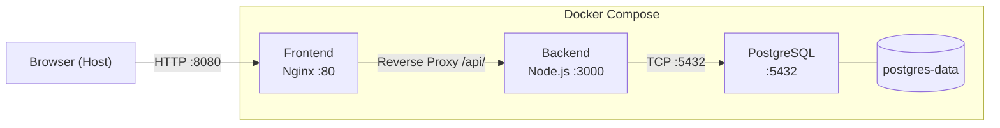

# Task Notes App – Deployment LB1

Einfache Task-/Notizen-App als Basis für das Deployment-Modul (HF).

**Technologie-Stack:**
- Backend: Node.js / Express
- Datenbank: PostgreSQL (`pg`)
- Frontend: HTML, CSS, Vanilla JS (kein Framework)
- Container: Docker (Dockerfile vorhanden)

---

## Projektstruktur

```
deployment-lb1-taskapp/
├── frontend/                   ← C1: Nginx-Frontend
│   ├── index.html
│   ├── style.css
│   ├── app.js
│   ├── nginx.conf              ← Nginx-Konfiguration mit Reverse Proxy
│   └── Dockerfile
├── backend/
│   ├── src/
│   │   ├── app.js              ← Express-App (Routen, Middleware)
│   │   ├── db.js               ← Datenbankverbindung & Init
│   │   ├── logger.js           ← Einfacher JSON-Logger
│   │   └── routes/
│   │       └── tasks.js        ← Task-API-Routen
│   ├── public/                 ← Statisches Frontend (für lokale Entwicklung)
│   │   ├── index.html
│   │   ├── style.css
│   │   └── app.js
│   ├── tests/
│   │   └── logger.test.js      ← Einfacher Logger-Test
│   ├── server.js               ← Einstiegspunkt
│   ├── package.json
│   ├── Dockerfile
│   └── .dockerignore
├── docker-compose.yml          ← C1: Multi-Service Architektur
├── .env.example                ← Vorlage für Umgebungsvariablen
├── .env                        ← Lokale Werte (nicht in Git!)
└── .gitignore
```

---

## Lokale Einrichtung

### Voraussetzungen

- Node.js >= 18
- PostgreSQL (lokal oder via Docker)

### 1. Abhängigkeiten installieren

```bash
cd backend
npm install
```

### 2. Umgebungsvariablen einrichten

```bash
cp .env.example .env
# .env anpassen (DB-Verbindungsdaten eintragen)
```

### 3. Server starten

```bash
# Produktion
npm start

# Entwicklung (mit Auto-Reload)
npm run dev
```

Die App ist dann unter **http://localhost:3000** erreichbar.

---

## Umgebungsvariablen

| Variable      | Standard        | Beschreibung                  |
|---------------|-----------------|-------------------------------|
| `PORT`        | `3000`          | HTTP-Port des Servers         |
| `APP_NAME`    | `Task Notes App`| Anzeigename der App           |
| `APP_VERSION` | `1.0.0`         | Versionsnummer                |
| `DB_HOST`     | –               | PostgreSQL-Host               |
| `DB_PORT`     | `5432`          | PostgreSQL-Port               |
| `DB_USER`     | –               | Datenbankbenutzer             |
| `DB_PASSWORD` | –               | Datenbankpasswort             |
| `DB_NAME`     | –               | Datenbankname                 |

---

## API-Endpunkte

| Methode | Pfad                  | Beschreibung                    |
|---------|-----------------------|---------------------------------|
| GET     | `/api/health`         | Gesundheitsstatus der App       |
| GET     | `/api/info`           | Entwickler-Infos                |
| GET     | `/api/status`         | Hostname, App-Name, Version     |
| GET     | `/api/tasks`          | Alle Tasks zurückgeben          |
| POST    | `/api/tasks`          | Neuen Task erstellen            |
| GET     | `/api/tasks/:id`      | Einzelnen Task abrufen          |
| DELETE  | `/api/tasks/:id`      | Task löschen                    |
| GET     | `/api/search?query=…` | Tasks nach Titel/Beschreibung suchen |

### Beispiel: Task erstellen

```bash
curl -X POST http://localhost:3000/api/tasks \
  -H "Content-Type: application/json" \
  -d '{"title": "Aufgabe 1", "description": "Erste Aufgabe"}'
```

---

## Tests

```bash
cd backend
npm test
```

Der Test prüft den eingebauten JSON-Logger (kein externes Test-Framework nötig, nutzt `node:test`).

---

## Docker

### Image bauen

```bash
cd backend
docker build -t taskapp:local .
```

### Container starten

```bash
docker run -p 3000:3000 \
  -e DB_HOST=host.docker.internal \
  -e DB_PORT=5432 \
  -e DB_USER=taskuser \
  -e DB_PASSWORD=geheimespasswort \
  -e DB_NAME=taskdb \
  taskapp:local
```

> **Hinweis:** `host.docker.internal` verweist aus dem Container auf den Host-Rechner (funktioniert unter Docker Desktop für Windows/Mac). Unter Linux muss `--add-host=host.docker.internal:host-gateway` ergänzt werden.

---

---

## C1 – Multi-Service Architektur mit Docker Compose

### Beschreibung

In C1 läuft die gesamte Anwendung in Docker Compose mit drei Services, die über eigene Netzwerke kommunizieren.

### Services

| Service    | Image / Build     | Port (Host) | Aufgabe                              |
|------------|-------------------|-------------|--------------------------------------|
| `frontend` | `./frontend`      | 8080        | Nginx liefert HTML/CSS/JS aus, proxyt `/api/*` ans Backend |
| `backend`  | `./backend`       | –           | Node.js API, verbindet sich mit PostgreSQL |
| `postgres` | `postgres:16-alpine` | –        | Datenbank, nur für Backend erreichbar |

### Architektur



### Netzwerke

| Netzwerk           | Wer ist verbunden          | Zweck                              |
|--------------------|----------------------------|------------------------------------|
| `frontend-network` | Frontend ↔ Backend         | Frontend kann API aufrufen         |
| `backend-network`  | Backend ↔ PostgreSQL       | DB ist von aussen nicht erreichbar |

### Einrichtung und Start

```bash
# 1. Umgebungsvariablen vorbereiten
cp .env.example .env

# 2. Alle Services bauen und starten
docker compose up --build

# 3. Browser öffnen
# http://localhost:8080
```

### Nützliche Befehle

```bash
# Status aller Services anzeigen
docker compose ps

# Alle Logs live verfolgen
docker compose logs -f

# Logs einzelner Services
docker compose logs backend
docker compose logs frontend
docker compose logs postgres

# Services stoppen (Daten bleiben erhalten)
docker compose down

# Services stoppen UND Volume löschen (Daten weg!)
docker compose down -v
```

### Erklärungen

**Benanntes Volume (`postgres-data`)**
Speichert die PostgreSQL-Daten auf dem Host. Auch wenn der Container neugestartet oder gelöscht wird, bleiben die Daten erhalten. Nur `docker compose down -v` löscht sie.

**Healthchecks und depends_on**
- `postgres` hat einen Healthcheck mit `pg_isready`
- `backend` hat einen Healthcheck auf `GET /api/health`
- `frontend` startet erst, wenn das Backend gesund ist
- `backend` startet erst, wenn PostgreSQL gesund ist
→ Kein Service startet zu früh und läuft gegen eine noch nicht bereite Abhängigkeit.

**Restart Policies (`restart: unless-stopped`)**
Wenn ein Service abstürzt, startet Docker ihn automatisch neu. Nur ein manuelles `docker compose down` stoppt ihn dauerhaft.

**Netzwerktrennung**
PostgreSQL ist nur im `backend-network` und hat keinen Host-Port. Von aussen (Browser oder Host) ist die Datenbank nicht direkt erreichbar.

**Logs**
- Backend: strukturiertes JSON auf stdout → `docker compose logs backend`
- Frontend (Nginx): strukturiertes JSON-Zugriffslog auf stdout → `docker compose logs frontend`
- PostgreSQL: Standard-Postgres-Format → `docker compose logs postgres`
  *(JSON-Logs bei PostgreSQL erfordern eine eigene Config-Datei und wurden bewusst weggelassen, um die Konfiguration einfach zu halten.)*

**Reverse Proxy**
Nginx leitet alle Anfragen an `/api/*` automatisch an `http://backend:3000` weiter. Der Browser muss die Backend-URL nicht kennen – alles läuft über Port 8080.

---

## Nächste Schritte (Challenges)

| Challenge | Inhalt                                      | Status        |
|-----------|---------------------------------------------|---------------|
| **C1**    | Docker Compose (App + Datenbank zusammen)   | ✅ Implementiert |
| **C2**    | GitHub Actions CI/CD Pipeline               | Noch nicht implementiert |
| **C3**    | Cloud-Deployment                            | Noch nicht implementiert |

Jede Challenge wird Schritt für Schritt auf dieser Basis aufgebaut.
