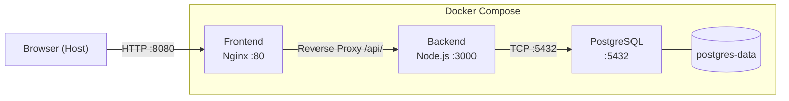
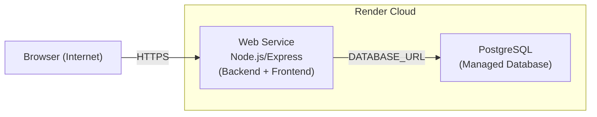

# Task Notes App – Deployment LB1

Einfache Task-/Notizen-App als Basis für das Deployment-Modul (HF).

**Technologie-Stack:**
- Backend: Node.js / Express
- Datenbank: PostgreSQL (`pg`)
- Frontend: HTML, CSS, Vanilla JS (kein Framework)
- Container: Docker (Dockerfile vorhanden)

---

## Projektstruktur

```
deployment-lb1-taskapp/
├── frontend/                   ← C1: Nginx-Frontend
│   ├── index.html
│   ├── style.css
│   ├── app.js
│   ├── nginx.conf              ← Nginx-Konfiguration mit Reverse Proxy
│   └── Dockerfile
├── backend/
│   ├── src/
│   │   ├── app.js              ← Express-App (Routen, Middleware)
│   │   ├── db.js               ← Datenbankverbindung & Init
│   │   ├── logger.js           ← Einfacher JSON-Logger
│   │   └── routes/
│   │       └── tasks.js        ← Task-API-Routen
│   ├── public/                 ← Statisches Frontend (für lokale Entwicklung)
│   │   ├── index.html
│   │   ├── style.css
│   │   └── app.js
│   ├── tests/
│   │   └── logger.test.js      ← Einfacher Logger-Test
│   ├── server.js               ← Einstiegspunkt
│   ├── package.json
│   ├── Dockerfile
│   └── .dockerignore
├── docker-compose.yml          ← C1: Multi-Service Architektur
├── .env.example                ← Vorlage für Umgebungsvariablen
├── .env                        ← Lokale Werte (nicht in Git!)
└── .gitignore
```

---

## Lokale Einrichtung

### Voraussetzungen

- Node.js >= 18
- PostgreSQL (lokal oder via Docker)

### 1. Abhängigkeiten installieren

```bash
cd backend
npm install
```

### 2. Umgebungsvariablen einrichten

```bash
cp .env.example .env
# .env anpassen (DB-Verbindungsdaten eintragen)
```

### 3. Server starten

```bash
# Produktion
npm start

# Entwicklung (mit Auto-Reload)
npm run dev
```

Die App ist dann unter **http://localhost:3000** erreichbar.

---

## Umgebungsvariablen

| Variable      | Standard        | Beschreibung                  |
|---------------|-----------------|-------------------------------|
| `PORT`        | `3000`          | HTTP-Port des Servers         |
| `APP_NAME`    | `Task Notes App`| Anzeigename der App           |
| `APP_VERSION` | `1.0.0`         | Versionsnummer                |
| `DB_HOST`     | –               | PostgreSQL-Host               |
| `DB_PORT`     | `5432`          | PostgreSQL-Port               |
| `DB_USER`     | –               | Datenbankbenutzer             |
| `DB_PASSWORD` | –               | Datenbankpasswort             |
| `DB_NAME`     | –               | Datenbankname                 |

---

## API-Endpunkte

| Methode | Pfad                  | Beschreibung                    |
|---------|-----------------------|---------------------------------|
| GET     | `/api/health`         | Gesundheitsstatus der App       |
| GET     | `/api/info`           | Entwickler-Infos                |
| GET     | `/api/status`         | Hostname, App-Name, Version     |
| GET     | `/api/tasks`          | Alle Tasks zurückgeben          |
| POST    | `/api/tasks`          | Neuen Task erstellen            |
| GET     | `/api/tasks/:id`      | Einzelnen Task abrufen          |
| DELETE  | `/api/tasks/:id`      | Task löschen                    |
| GET     | `/api/search?query=…` | Tasks nach Titel/Beschreibung suchen |

### Beispiel: Task erstellen

```bash
curl -X POST http://localhost:3000/api/tasks \
  -H "Content-Type: application/json" \
  -d '{"title": "Aufgabe 1", "description": "Erste Aufgabe"}'
```

---

## Tests

```bash
cd backend
npm test
```

Der Test prüft den eingebauten JSON-Logger (kein externes Test-Framework nötig, nutzt `node:test`).

---

## Docker

### Image bauen

```bash
cd backend
docker build -t taskapp:local .
```

### Container starten

```bash
docker run -p 3000:3000 \
  -e DB_HOST=host.docker.internal \
  -e DB_PORT=5432 \
  -e DB_USER=taskuser \
  -e DB_PASSWORD=geheimespasswort \
  -e DB_NAME=taskdb \
  taskapp:local
```

> **Hinweis:** `host.docker.internal` verweist aus dem Container auf den Host-Rechner (funktioniert unter Docker Desktop für Windows/Mac). Unter Linux muss `--add-host=host.docker.internal:host-gateway` ergänzt werden.

---

---

## C1 – Multi-Service Architektur mit Docker Compose

### Beschreibung

In C1 läuft die gesamte Anwendung in Docker Compose mit drei Services, die über eigene Netzwerke kommunizieren.

### Services

| Service    | Image / Build     | Port (Host) | Aufgabe                              |
|------------|-------------------|-------------|--------------------------------------|
| `frontend` | `./frontend`      | 8080        | Nginx liefert HTML/CSS/JS aus, proxyt `/api/*` ans Backend |
| `backend`  | `./backend`       | –           | Node.js API, verbindet sich mit PostgreSQL |
| `postgres` | `postgres:16-alpine` | –        | Datenbank, nur für Backend erreichbar |

### Architektur



### Netzwerke

| Netzwerk           | Wer ist verbunden          | Zweck                              |
|--------------------|----------------------------|------------------------------------|
| `frontend-network` | Frontend ↔ Backend         | Frontend kann API aufrufen         |
| `backend-network`  | Backend ↔ PostgreSQL       | DB ist von aussen nicht erreichbar |

### Einrichtung und Start

```bash
# 1. Umgebungsvariablen vorbereiten
cp .env.example .env

# 2. Alle Services bauen und starten
docker compose up --build

# 3. Browser öffnen
# http://localhost:8080
```

### Nützliche Befehle

```bash
# Status aller Services anzeigen
docker compose ps

# Alle Logs live verfolgen
docker compose logs -f

# Logs einzelner Services
docker compose logs backend
docker compose logs frontend
docker compose logs postgres

# Services stoppen (Daten bleiben erhalten)
docker compose down

# Services stoppen UND Volume löschen (Daten weg!)
docker compose down -v
```

### Erklärungen

**Benanntes Volume (`postgres-data`)**
Speichert die PostgreSQL-Daten auf dem Host. Auch wenn der Container neugestartet oder gelöscht wird, bleiben die Daten erhalten. Nur `docker compose down -v` löscht sie.

**Healthchecks und depends_on**
- `postgres` hat einen Healthcheck mit `pg_isready`
- `backend` hat einen Healthcheck auf `GET /api/health`
- `frontend` startet erst, wenn das Backend gesund ist
- `backend` startet erst, wenn PostgreSQL gesund ist
→ Kein Service startet zu früh und läuft gegen eine noch nicht bereite Abhängigkeit.

**Restart Policies (`restart: unless-stopped`)**
Wenn ein Service abstürzt, startet Docker ihn automatisch neu. Nur ein manuelles `docker compose down` stoppt ihn dauerhaft.

**Netzwerktrennung**
PostgreSQL ist nur im `backend-network` und hat keinen Host-Port. Von aussen (Browser oder Host) ist die Datenbank nicht direkt erreichbar.

**Logs**
- Backend: strukturiertes JSON auf stdout → `docker compose logs backend`
- Frontend (Nginx): strukturiertes JSON-Zugriffslog auf stdout → `docker compose logs frontend`
- PostgreSQL: Standard-Postgres-Format → `docker compose logs postgres`
  *(JSON-Logs bei PostgreSQL erfordern eine eigene Config-Datei und wurden bewusst weggelassen, um die Konfiguration einfach zu halten.)*

**Reverse Proxy**
Nginx leitet alle Anfragen an `/api/*` automatisch an `http://backend:3000` weiter. Der Browser muss die Backend-URL nicht kennen – alles läuft über Port 8080.

---

---

## C2 – CI/CD mit GitHub Actions

### Was C2 umsetzt

Bei jedem Push auf `main` läuft automatisch eine Pipeline die:
1. Tests ausführt
2. Ein Docker Image baut
3. Das Image in GitHub Container Registry (GHCR) publiziert

### Workflow-Datei

`.github/workflows/ci-cd.yml`

### Auslöser

| Trigger | Beschreibung |
|---|---|
| Push auf `main` | Automatisch bei jedem Commit |
| `workflow_dispatch` | Manuell über GitHub Actions UI |

### Pipeline-Stages

```
Push auf main
     │
     ▼
┌─────────┐     fehlgeschlagen → Pipeline stoppt
│  Test   │ ──────────────────────────────────►  ✗
└─────────┘
     │ erfolgreich
     ▼
┌──────────────────┐
│  Build & Push    │  → Image in GHCR
└──────────────────┘
```

| Job | Was passiert |
|---|---|
| `test` | Node.js 24 einrichten, `npm ci`, `npm test` |
| `build-and-push` | Docker Buildx, Login GHCR, Image bauen, pushen |

### Image in GHCR

```
ghcr.io/<owner>/<repo>-backend:latest
ghcr.io/<owner>/<repo>-backend:<git-sha>
```

- `latest` → immer der neueste Stand von `main`
- `<git-sha>` → eindeutig, auf jeden Commit zurückverfolgbar

### Authentifizierung

Der eingebaute `GITHUB_TOKEN` wird verwendet. Es müssen **keine Passwörter oder Secrets manuell gesetzt werden**. Die Berechtigungen sind direkt im Workflow definiert:

```yaml
permissions:
  contents: read
  packages: write
```

### Caching

| Cache | Zweck |
|---|---|
| npm Cache (`cache-dependency-path`) | `node_modules` werden gecacht, `npm ci` läuft schneller |
| Docker Layer Cache (`type=gha`) | Unveränderte Image-Schichten werden wiederverwendet |

### Warum GitHub Actions?

- Direkt in GitHub integriert, kein externes Tool nötig
- `GITHUB_TOKEN` ist automatisch vorhanden
- GHCR ist kostenlos für öffentliche Repos

### Warum GHCR?

- Gleiche Plattform wie der Code (GitHub)
- Kein separates Konto bei Docker Hub nötig
- Kostenfrei für öffentliche Repositories

### Warum nur das Backend-Image?

Das Frontend (Nginx + statische Dateien) ändert sich selten. PostgreSQL ist ein offizielles Image. Nur das Backend enthält eigene Anwendungslogik → nur das Backend-Image wird publiziert. Das hält die Pipeline einfach.

### Pipeline reproduzieren

```bash
# 1. Code auf main pushen (oder manuell starten)
git push origin main

# 2. GitHub → Actions Tab → laufende Pipeline beobachten

# 3. GitHub → Packages → Image prüfen

# 4. Image lokal pullen
docker pull ghcr.io/<owner>/<repo>-backend:latest
```

### Hinweis zu C1

Docker Compose bleibt vollständig erhalten und wird durch C2 nicht verändert. C1 (`docker compose up --build`) funktioniert weiterhin für den lokalen Betrieb.

---

---

## C3 – Cloud Deployment auf Render

### Was C3 umsetzt

Die App läuft auf der Cloud-Plattform **Render** mit einer öffentlichen HTTPS-URL. Das Express-Backend stellt die REST-API bereit und liefert das Frontend aus. Die Daten werden in einer verwalteten Render-PostgreSQL-Datenbank gespeichert und überleben Neustarts und Redeploys.

### Warum Render?

Render unterstützt Node.js Web Services, GitHub-basierte Auto-Deployments, Umgebungsvariablen, öffentliche HTTPS-URLs, verwaltetes PostgreSQL und ein Log-Dashboard — alles was dieses Projekt braucht, kostenlos nutzbar.

### Cloud-Architektur



Für C3 liefert das Express-Backend das Frontend direkt aus dem `public/`-Ordner aus — kein separater Nginx-Container nötig. Der C1 Docker Compose Setup (mit Nginx) bleibt unverändert für den lokalen Betrieb.

### Öffentliche URL

```
https://YOUR-RENDER-APP-URL.onrender.com
```

### Render Services einrichten

#### Schritt 1 – PostgreSQL Datenbank erstellen

1. Render Dashboard → **New → PostgreSQL**
2. Name vergeben (z.B. `taskapp-db`)
3. Region wählen (z.B. Frankfurt)
4. Plan: **Free**
5. **Create Database** klicken
6. Nach dem Start: **Internal Database URL** kopieren (wird in Schritt 2 benötigt)

#### Schritt 2 – Web Service erstellen

1. Render Dashboard → **New → Web Service**
2. GitHub Repository verbinden: `deployment-lb1-taskapp`
3. Einstellungen:

| Feld | Wert |
|---|---|
| **Name** | `taskapp` (oder beliebig) |
| **Region** | gleiche wie die Datenbank |
| **Branch** | `main` |
| **Root Directory** | *(leer lassen)* |
| **Build Command** | `cd backend && npm ci` |
| **Start Command** | `cd backend && npm start` |
| **Plan** | Free |

#### Schritt 3 – Umgebungsvariablen setzen

Im Web Service → **Environment** folgende Variablen eintragen:

| Variable | Wert |
|---|---|
| `APP_NAME` | `Task Notes App` |
| `APP_VERSION` | `1.0.0` |
| `DATABASE_URL` | Internal Database URL aus Schritt 1 |

> `PORT` wird von Render automatisch gesetzt — nicht manuell eintragen.
> Keine Passwörter oder Secrets im Repository — alle Werte werden nur im Render Dashboard gespeichert.

#### Schritt 4 – Deployment starten

**Save** klicken → Render startet automatisch den ersten Deploy.
Logs sind live im **Logs**-Tab sichtbar.

#### Schritt 5 – App öffnen

Nach erfolgreichem Deploy: **URL** oben im Dashboard klicken.

### Wie DATABASE_URL funktioniert

Render stellt bei einer verbundenen PostgreSQL-Datenbank automatisch eine `DATABASE_URL` bereit. Der Code erkennt diese Variable und nutzt sie bevorzugt:

```js
// db.js – DATABASE_URL hat Vorrang (Render), sonst DB_* Variablen (C1 lokal)
const pool = process.env.DATABASE_URL
  ? new Pool({ connectionString: process.env.DATABASE_URL, ssl: { rejectUnauthorized: false } })
  : new Pool({ host: process.env.DB_HOST, ... });
```

### Persistente Datenspeicherung

Render PostgreSQL ist eine verwaltete Datenbank. Tasks bleiben erhalten auch wenn der Web Service neu gestartet oder neu deployed wird. Nur ein manuelles Löschen der Datenbank entfernt die Daten.

### Logs anzeigen

Das Backend schreibt strukturierte JSON-Logs auf stdout:
```json
{"timestamp":"2026-05-17T10:00:00.000Z","level":"info","message":"Server gestartet","port":3000}
```

Logs anzeigen: Render Dashboard → Web Service → **Logs** Tab.

### Auto-Deploy

Das GitHub Repository ist mit Render verbunden. Jeder Push auf `main` löst automatisch einen neuen Deploy aus. Kein manueller Schritt nötig.

### Deployment verifizieren

```
# Gesundheitscheck
https://YOUR-RENDER-APP-URL.onrender.com/api/health

# App-Status (zeigt Hostname und Version)
https://YOUR-RENDER-APP-URL.onrender.com/api/status

# Frontend
https://YOUR-RENDER-APP-URL.onrender.com
```

1. Task erstellen
2. Web Service in Render neu starten (Dashboard → Manual Deploy oder Restart)
3. Prüfen ob Task noch vorhanden ist → Persistenz bestätigt

### Hinweis zu C1 und C2

- **C1** Docker Compose läuft weiterhin lokal mit `docker compose up --build`
- **C2** GitHub Actions Pipeline publiziert weiterhin das Backend-Image in GHCR
- C3 ergänzt beide — nichts wird entfernt oder gebrochen

### C3-Checkliste

- [ ] Öffentliche HTTPS-URL erreichbar
- [ ] Render als Plattform genannt und begründet
- [ ] Umgebungsvariablen im Render Dashboard gesetzt
- [ ] Keine Secrets im Repository
- [ ] Render PostgreSQL Datenbank verbunden (`DATABASE_URL`)
- [ ] Daten überleben Neustart/Redeploy
- [ ] Deployment via GitHub Auto-Deploy reproduzierbar
- [ ] Strukturierte JSON-Logs im Render Log-Tab sichtbar
- [ ] README aktualisiert

---

## Übersicht Challenges

| Challenge | Inhalt                                      | Status        |
|-----------|---------------------------------------------|---------------|
| **C1**    | Docker Compose (App + Datenbank zusammen)   | ✅ Implementiert |
| **C2**    | GitHub Actions CI/CD Pipeline               | ✅ Implementiert |
| **C3**    | Cloud-Deployment auf Render                 | ✅ Implementiert |
